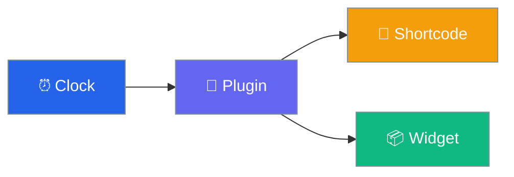

# Live Clock Widget

Modern analog and digital clock for WordPress.

## Quick Start

1. **Install** → Upload plugin
2. **Use** → `[wpclock]` shortcode
3. **Done!** 🎉

## Features

| Feature | Description |
|---------|-------------|
| ⏰ Analog | Classic clock face |
| 🔢 Digital | Modern digital display |
| 🌍 Timezone | Custom timezone support |
| 📦 Widget | Sidebar widget |

## Next Steps

- [Installation](getting-started/installation.md)
- [Usage Guide](getting-started/usage.md)
